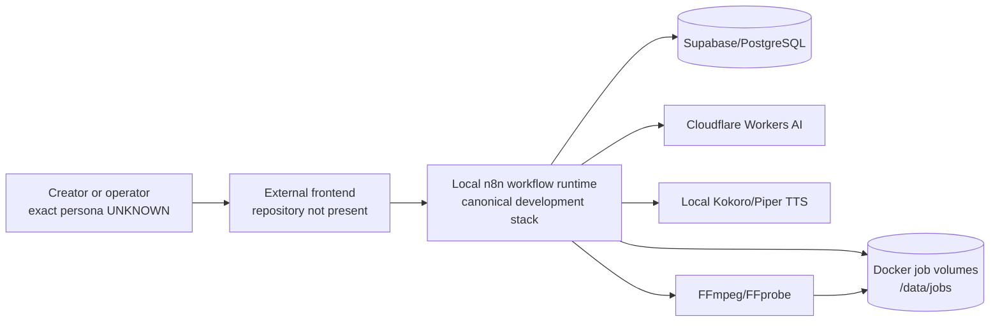
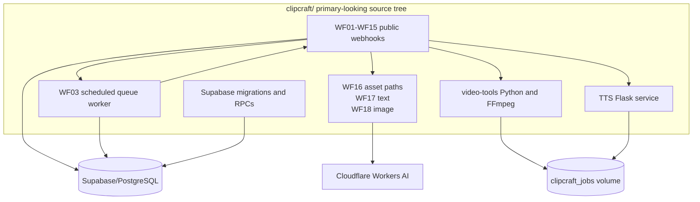
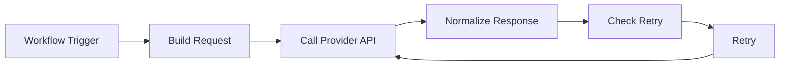
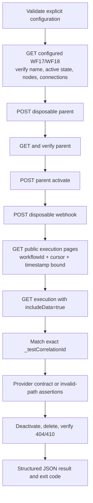

# System Architecture

## Scope and Evidence

The diagrams describe repository-supported relationships. Dashed or labelled unknown boundaries indicate behavior documented but not implemented or not runtime-verified.

## System Context

The frontend relationship is documented but the frontend implementation is outside this repository.

## Component Architecture

## WF17 Execution Flow From Repository JSON

The source JSON currently has no `Validate Input` or `Handle Validation Error` nodes. The handoff says live remediation added them, but live state was not contacted. This conflict is recorded in `CURRENT_STATE.md`.

## WF18 Execution Flow From Repository JSON

WF18 has the same source topology as WF17, with image-specific request construction and response normalization.

## Functional-Test Flow

## Authentication Boundaries

- Functional verification uses `X-N8N-API-KEY` for documented n8n public API calls.
- Workflow service calls use environment-driven Cloudflare, Supabase, internal API, and TTS credentials.
- WF15 documents `X-Internal-Api-Key` authentication.
- Public WF01/WF02 source does not show caller authentication.
- Supabase service-role access is used from n8n and bypasses RLS; user-level authorization is not established.

## Observability

The repository provides n8n healthchecks and structured job status fields. A production metrics, logging, tracing, alerting, or retention design is **UNKNOWN**. n8n execution pruning is configured in `clipcraft/docker-compose.yml`.

## Deployment Architecture

The primary Docker Compose file defines `clipcraft-n8n` and `clipcraft-tts`, bridge networking, persistent volumes, healthchecks, and a host mapping of `5680:5678`. The alternate `n8n-video-factory/` stack uses different ports and image assumptions. The `clipcraft/` stack is the canonical local-development runtime; no separate production deployment is assumed.
